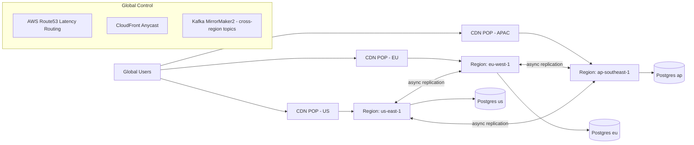

# 03 — High-Level Architecture

**WorldView VR** | Version 1.0 | Status: Draft

This document describes the system topology, platform choices, and the key trade-offs. Detailed service internals are in [Low-Level Design](04-low-level-design.md).

---

## 1. Architecture Principles

1. **Streaming is the core competency** — the platform is built around the media pipeline; everything else (AI, social, commerce) is a satellite service.
2. **Event-driven, decoupled** — Kafka (Confluent) as the backbone; services communicate via events for fan-out, search indexing, analytics, and notification.
3. **Multi-region active-active** from day one — EU + US-East + APAC pods behind global edge; data partitioned per region with global read replicas where GDPR-safe.
4. **Stateless services, stateful stores** — every microservice is stateless & horizontally scalable; state lives in purpose-built stores (Postgres, Redis, S3, Kafka, Milvus).
5. **Cost-aware fan-out** — WebRTC mesh for interactive VR (sub-second latency, high cost), LL-HLS/CDN for mass scale (seconds latency, low cost), tiered by client & entitlement.
6. **Fail-slow, fail-safe** — degrade gracefully: video can drop to flat 1080p + audio if 360°/4K fails; AI guide can degrade to scripted narration.
7. **Security & privacy by design** — zero-trust, least privilege, regional data residency, moderation inline.

---

## 2. High-Level System Diagram

```mermaid
flowchart TB
    subgraph Clients
        C1[VR Headset<br/>Quest / Pico / Vision Pro]
        C2[Mobile iOS/Android]
        C3[Web / WebXR]
        C4[Desktop Win/mac]
        C5[Creator Devices<br/>360 cam / drone / phone]
    end

    subgraph Edge [Global Edge - CloudFront / Cloudflare]
        G[CDN + WAF + DDoS Shield<br/>TLS termination]
        LB[API Gateway / L7 LB<br/>auth, rate limit, routing]
    end

    subgraph Core [Control Plane - per region pod]
        GW[API Gateway<br/>REST + WebSocket + gRPC]
        AUTH[Identity & AuthN/Z]
        CAT[Catalog & Search]
        REC[Recommendation]
        PAY[Payments & Billing]
        USR[User & Creator Services]
        MOD[Moderation]
        NOT[Notifications]
        ADV[AI Guide Orchestrator]
    end

    subgraph Media [Media Plane]
        ING[Ingest (SRT/RTMP) + Transcode Farm]
        PACK[LL-HLS Packager]
        WTS[WebRTC SFU Mesh<br/>selective forwarding]
        VOD[VOD Asset Store S3 + CDN]
        SR[Signaling / TURN]
    end

    subgraph Data [Data Plane]
        PG[(Postgres primary/standby)]
        REDIS[(Redis cache/session/presence)]
        KFK[(Kafka event bus)]
        MIL[(Milvus vector DB)]
        TS[(TimescaleDB metrics)]
        LAKE[(Data lake S3 + Iceberg)]
    end

    C1 --- G
    C2 --- G
    C3 --- G
    C4 --- G
    C5 --> ING

    G --> LB
    LB --> GW
    GW --> AUTH
    GW --> CAT
    GW --> REC
    GW --> PAY
    GW --> USR
    GW --> MOD
    GW --> NOT
    GW --> ADV

    ING --> PACK
    PACK --> VOD
    PACK --> WTS
    WTS --> C1
    WTS --> C3
    SR --> WTS

    GW --> PG
    GW --> REDIS
    GW --> KFK
    KFK --> MIL
    KFK --> TS
    KFK --> LAKE
    ADV --> MIL
```

## 3. Control Plane (Per-Region Services)

| Service | Responsibility | Key tech |
|---|---|---|
| **API Gateway** | AuthN/Z, routing, rate limits, WAF rules, request signing | Envoy / Kong + CloudFront |
| **Identity** | OAuth/OIDC, sessions, devices, MFA, consent registry | Keycloak (self-hosted) or Auth0; Postgres |
| **User & Creator** | Profiles, verification, subscriptions, creator tooling | Go/Rust service, Postgres |
| **Catalog & Search** | Tours, POIs, hotspots, content search | Elasticsearch/OpenSearch + Postgres |
| **Recommendation** | Personalization, "trending", itineraries | Redis + Milvus + online learning (T1) |
| **AI Guide Orchestrator** | RAG pipeline, vision, TTS, translation | Python + vector DB + model gateways |
| **Moderation** | Text/vision/model-in-loop moderation, risk scoring | Kafka + Hive/Azure Content Safety + human queue |
| **Payments** | Subscriptions, tips, pay-per-tour, payouts | Stripe + Adyen; PCI scope avoided |
| **Notifications** | Push (APNs/FCM), email, in-app | SNS/FCM + SES/SendGrid |
| **Social/Presence** | Avatars, watch-together sync, presence, rooms | Redis + WebSocket + (T1) LiveKit |

## 4. Media Plane

### 4.1 Ingest & Transcode
- Creator pushes **SRT** (UDP, loss-resilient, firewall-friendly) or RTMPS into regional ingest edge.
- **Transcode farm:** FFmpeg-based (AWS MediaConvert or self-managed GStreamer on EC2/Spot or Kubernetes MediaPods). Produces tiled 360° variants: equirectangular tile set (e.g., 6–24 tiles), ABR ladder, spatial audio pass-through (Ambisonics).
- **Key decision:** tiled streaming means the player only downloads the tiles in the viewer's viewport → 4×–10× bandwidth savings vs. full-frame equirect.

### 4.2 Delivery Paths (tiered by latency/entitlement)
| Path | Latency | Cost | Used by |
|---|---|---|---|
| **WebRTC (LiveKit SFU mesh)** | 400–900 ms | high | VR headsets, interactive features, premium |
| **LL-HLS** (2–4 s) | 2–4 s | low | Mobile/web free tier, mass scale |
| **HLS/DASH VOD** | on-demand | very low | Archived tours, offline |

### 4.3 Spatial Audio
- Ambisonics FOA pass-through in media pipeline; binaural renderer client-side (Resonance Audio / Meta Spatializer). Server does loudness normalization + gating.

### 4.4 Storage & CDN
- Raw + mezzanine in S3 (or per-region S3-compatible); CDN = CloudFront/Cloudflare with signed URLs, token auth, per-region origin groups, cache at POPs.

---

## 5. Data Plane

- **PostgreSQL** (Aurora/RDS or Cloud Spanner for global): primary metadata store; multi-region via active-active per-region shards keyed on region, plus global read replicas.
- **Redis**: session, presence, hot-cache, rate-limit counters, leaderboard.
- **Kafka**: event backbone (stream events, chat fan-out, telemetry, moderation ingest).
- **Milvus (vector DB)**: embeddings for AI guide RAG (POI knowledge, transcripts, captions), semantic search, similarity for recommendations. T1.
- **TimescaleDB**: streaming/ops metrics, watch-time analytics.
- **S3 + Iceberg (lakehouse)**: raw events → parquet, warehouse for BI (Athena/Trino).

---

## 6. Multi-Region & Global Deployment



**Design choice — active-active regions vs. active-passive:**
- **Active-active** is required for the live streaming latency SLOs (a viewer in Tokyo cannot talk to a stream origin in Virginia). We accept higher infra cost for correctness.
- **Trade-off:** conflict resolution on metadata. Mitigation: region-affinity writes; cross-region conflict resolver for user profiles/books; streams are immutable once created.

## 7. Technology Stack (with justification)

| Layer | Choice | Why |
|---|---|---|
| **VR engine** | Unity 6 (primary), Unreal 5 for high-end PC VR/PSVR2 (secondary) | Unity: fastest time-to-market across Quest/Pico/Vision Pro; huge community; AR Foundation/MR support. Unreal 5 (Nanite/Lumen) for cinematic digital-twin content later. |
| **3D/rendering (web)** | three.js + WebXR + react-three-fiber | Web support without native install; fallback to standard video for low-end. |
| **Mobile** | React Native (Expo) | One codebase iOS/Android; native VR SDKs only wrapped in thin plugins. Native Swift/Kotlin escape hatches for perf. |
| **Desktop** | Electron shell reusing web player (or Unity standalone) | Fast iteration; camera/app parity with web. |
| **Streaming ingest** | SRT (primary), RTMP (compat) | SRT survives packet loss on mobile/remote; NAT-friendly vs RTMP. |
| **Transcode/packaging** | GStreamer/FFmpeg on K8s media pods (or AWS MediaConvert) | Full control over tiling + cost at scale; fallback to managed service early. |
| **Real-time comms** | LiveKit (WebRTC SFU, open-source) | Battle-tested SFU for VR voice+video, room/state, selective forwarding; self-host or LiveKit Cloud. |
| **API** | Go (services), Python (AI), gRPC internal + REST/WS external | Go = perf+concurrency for real-time; Python = ML ecosystem. |
| **AI services** | Multi-model gateway (OpenAI/Anthropic/Google Gemini) with provider failover; vision (Gemini/GPT-4o/Claude); ASR (Deepgram/Whisper); TTS (ElevenLabs/Azure); translation (DeepL/NMT) | Vendor diversification → cost + resilience; abstract behind `Model Gateway` service. |
| **Vector DB** | Milvus (self-host on K8s) | Scale to 100Ms vectors, hybrid + metadata filter, open source. Qdrant/pgvector acceptable at MVP. |
| **Search** | OpenSearch | Full-text + geo + facets; rich relevance tuning; managed option. |
| **Primary DB** | PostgreSQL (Aurora) → Cloud Spanner at extreme global scale | ACID for money/user data; Postgres productivity; Spanner if cross-region strong consistency needed (T2). |
| **Cache/real-time** | Redis (ElastiCache) | Standard, battle-tested. |
| **Event bus** | Kafka (MSK) + MirrorMaker2 | Durable event backbone, replay, cross-region. |
| **Object storage/CDN** | S3 + CloudFront (+ optional Cloudflare edge) | Mature, global anycast, signed URLs, tile caching. |
| **Cloud** | AWS (primary), Azure (EU residency option), GCP (AI-friendly secondary) | Multi-cloud flexibility; start single-cloud, abstraction layer on media/AI. |
| **Auth** | Keycloak (self-hosted) with OIDC | Open source, customizable, no per-seat cost at scale; managed Auth0 as short-term accelerator. |
| **Payments** | Stripe (+ Adyen for EU/local cards) | Fast integration, Connect for creator payouts; Adyen for enterprise/local acquiring. |
| **DevOps** | Terraform, GitHub Actions, Argo CD, K8s (EKS), Helm | IaC + GitOps; consistent multi-region. |
| **Observability** | OpenTelemetry + Grafana/Prometheus + Datadog (optional) + Sentry | Vendor-neutral tracing/metrics; fast root-cause. |

## 8. Key Trade-offs Summary

| Decision | Chosen | Rejected | Why |
|---|---|---|---|
| Tiled 360° vs full equirect | Tiled viewport streaming | Full-frame | 4–10× bandwidth savings; player complexity ↑ |
| WebRTC vs LL-HLS for all | Tiered: WebRTC premium, LL-HLS mass | WebRTC everywhere | Cost: WebRTC ~5–10× CDN cost per hour |
| Microservices vs monolith | Microservices (bounded by domain) | Full micro-everything | Avoids distributed monolith; teams own services |
| Self-host vs managed media | Self-host transcode at scale; managed at MVP | All-managed forever | Cost control + tiling control |
| Multi-model AI vs single vendor | Gateway with failover | Single vendor lock | Resilience + price arbitrage |
| Active-active vs active-passive | Active-active regions | Active-passive | Live latency + global SLA |

## 9. System Qualities Enforced
- **Security:** zero-trust service mesh (mTLS via Istio), tokenized payments, signed media URLs, WAF, DDoS, privacy by design. See [Security](08-security-architecture.md).
- **Scalability:** stateless services + partition keys; Kafka partitions scale with consumers; CDN absorbs read spikes; SFU scale-out per room. See [LLD](04-low-level-design.md) §Scaling.
- **Observability:** OTel-instrumented everything; SLOs per service. See [DevOps](09-devops-cicd.md).
