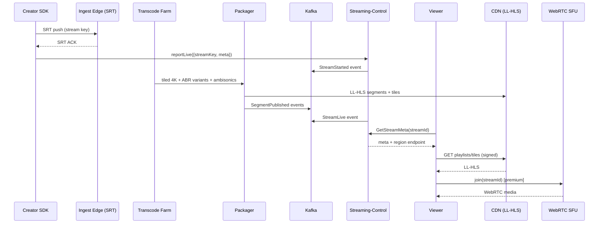
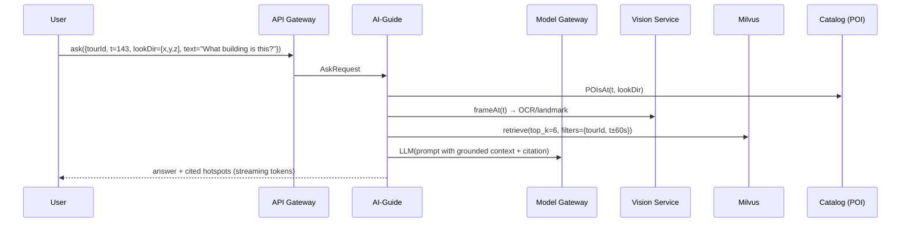

# 04 — Low-Level Design

**WorldView VR** | Version 1.0 | Status: Draft

Extends [High-Level Architecture](03-high-level-architecture.md). Covers service internals, key flows, scaling strategy, and failure handling.

---

## 1. Service Inventory & Ownership

| Service | Lang | Storage | Owns (bounded context) |
|---|---|---|---|
| `identity` | Go | Postgres + Redis | Users, sessions, MFA, consent, GDPR export/delete |
| `catalog` | Go | Postgres + OpenSearch | Tours, POIs, hotspots, regions, content lifecycle |
| `streaming-control` | Go | Postgres + Kafka + Redis | Stream sessions, states, DVR, VOD manifests |
| `media-pipeline` | Go (orchestrator) + C++/GStreamer (workers) | S3 | Ingest, transcode, tiling, packaging |
| `rtc` | Go + LiveKit | Redis + (SFU) | WebRTC signaling, rooms, voice |
| `social-presence` | Go | Redis + Postgres | Avatars, friends, presence, watch-sync |
| `chat` | Go | Redis + Kafka (fan-out) + Postgres | Messages, reactions, moderation hooks |
| `ai-guide` | Python | Milvus + Redis | RAG, vision, TTS, translation, itineraries |
| `moderation` | Python | Kafka + Postgres + S3 | Content safety, risk scoring, human queue |
| `payments` | Go | Postgres + Stripe | Subscriptions, tips, payouts, invoices |
| `recommend` | Python/Go | Milvus + Redis | Ranking, trending, discovery |
| `notifications` | Go | Redis + Kafka | Push, email, in-app |
| `admin` | Go/React | Postgres | Console, enterprise/group mgmt |
| `model-gateway` | Go | — | Multi-vendor LLM/vision/TTS routing + quota + failover |

## 2. Cross-Cutting Runtime Decisions

- **Language:** Go for control-plane services; Python for AI/inference-heavy; Rust optional for media libs.
- **RPC:** gRPC (protobuf) internal; REST/JSON + WebSocket external.
- **IDs:** ULID (time-ordered) — supports sharding, offline-friendly, sortable.
- **Tenancy:** single global logical tenant; region shard on `region_key`; tenant-level for Enterprise.
- **Config:** OTel config distribution; feature flags via LaunchDarkly/OpenFeature.
- **Retries/idempotency:** every write API accepts `Idempotency-Key`; queues are at-least-once with idempotent handlers (dedupe table).

## 3. Key Flows (Sequence Diagrams)

### 3.1 Live stream: creator goes live → viewer joins



### 3.2 AI guide grounded answer



### 3.3 Watch-together sync (social)

```mermaid
sequenceDiagram
    participant H as Host
    participant P as Presence
    participant W as Watch-Sync WS
    participant F as Friend
    participant M as Media Client

    H->>W: updateState({tourId, t, playState})
    W->>P: SetPresence(hash)
    P-->>F: push state
    F->>M: seek(t, playState)
    F-->>W: ack + drift report
    W->>H: leader stays; drift <250ms
```

## 4. Streaming Pipeline Deep-Dive

### 4.1 Ingest
- **SRT** over UDP 5000-5010; stream key = JWT-encrypted (HS256, 30 min TTL), scoped to creator + device.
- Ingest edge runs on spot-capable instances with jitter buffer tuning; SRT reliable over high-loss mobile uplinks (ARQ), survives NAT (no inbound ports).

### 4.2 Transcode & Tiling
- Input: equirectangular 360° 30/60fps, Ambisonics A.
- Output ladder per eye/surface:
  - Tiles: 24 tiles (8 cols × 3 rows) at 4K; 6 tiles (3×2) at 1080p; single tile 720p fallback.
  - Per-tile ABR profiles: 1.5/4/8/16 Mbps.
- Player requests tiles inside FoV + margin; lower-res neighbor tiles for pannable context → bandwidth 4–10× saved.
- **FOV prediction** (T1): use gaze/head velocity model to prefetch upcoming tiles → cuts stalls.

### 4.3 Packaging & Delivery
- LL-HLS: segment 2s, target 2–4 s glass-to-glass; partial segments (LL) 200 ms parts for sub-2s on capable players.
- WebRTC: LiveKit SFU, VP9/AV1 with simulcast (2 layers), SVC for headset upscaling; audio Opus spatialized client-side.
- **Signing:** all CDN URLs HMAC-signed (CloudFront trusted signer), short TTL (10 min) rotated on region hop.

### 4.4 Cost model (per 1000 viewer-min)
| Path | Media+CDN egress | Compute | Total |
|---|---|---|---|
| LL-HLS 1080p tiled | ~$0.09 | ~$0.02 | ~$0.11 |
| LL-HLS 4K tiled | ~$0.22 | ~$0.03 | ~$0.25 |
| WebRTC 4K (SFU) | ~$0.60 | ~$0.18 | ~$0.78 |

At 1M MAU × 20 min/day × 40% concurrent peak amortized → see [Roadmap](13-roadmap.md) §Costs.

## 5. Data Consistency & Transactions

- **Money paths** (payments, tips, payouts): Postgres transactions + outbox pattern (Kafka) → exactly-once accounting via idempotency keys; settlement reconciled nightly.
- **Stream state:** optimistic concurrency (version column) in `streaming-control`; Kafka events are source of truth for analytics/indexing.
- **Presence/chat:** eventual consistency (< 300 ms) via Redis Pub/Sub per room/region; cross-region rooms proxied via global presence topic (rare).
- **Search index:** dual-write (transactional DB + async indexer on Kafka) with replay; tolerate 60 s lag.

## 6. Scaling Strategy

### 6.1 Horizontal scaling rules
- Every service is `replicas >= 2`, auto-scaling on CPU (75%) + queue depth (Kafka consumer lag < 5000).
- Partition keys: `stream_id`, `room_id`, `region_key`; hot keys (mega-events) solved by pre-splitting partitions + CDN offload.
- Chat: shard rooms across Redis nodes; fan-out via Kafka topic per room to N subscribers, dedupe at edge.

### 6.2 Mega-event plan (Times Square NYE, 10× spike)
1. Pre-scale: raise autoscaler floors, pre-warm CDN caches, provision SFU pool.
2. Throttle: queue joins, degrade free tier to LL-HLS 720p, cap tips rate.
3. Chaos-gate: load-test at 120% of forecast before event; rollback runbook ready.

### 6.3 Cache strategy
- Catalog: Redis 10-min TTL, invalidation on events.
- Presence: Redis hash per room; TTL 60 s, heartbeat 10 s.
- Media manifests: CDN edge 2 s TTL.
- Recommendations: precomputed per-user top-100 refreshed nightly + real-time "trending" cached 5 min.

## 7. Failure Handling & Degradation

| Failure | Detection | Response |
|---|---|---|
| Creator uplink loss > 5 s | health ping on SRT | Auto-pause + "Connection lost" overlay; resume via SRT ARQ; no viewer stream kill |
| Transcode worker crash | job timeout | Re-assign job to healthy worker; keep last good segment |
| SFU node failure | room health monitor | Re-signal room to backup SFU in < 2 s |
| CDN POP degradation | origin health + DNS | Failover to nearest healthy POP via route53/CF |
| AI provider outage | model-gateway circuit breaker | Failover provider → scripted narration fallback → degraded banner |
| Kafka broker down | cluster health | MSK auto-heal; producers buffer 5 min; consumers lag alert |
| Postgres primary failover | RDS/Aurora managed | Read-replica promotion < 60 s; app retry-on-connection |

## 8. Security-Relevant LLD Decisions
- mTLS mesh (Istio) for service-to-service; secrets in AWS KMS + Parameter Store; media URLs signed.
- Every external call passes the API Gateway: rate limits (per user/IP), input validation (protobuf/json schema), audit log.
- Vertical slice for GDPR: `identity` holds consent registry; export/delete is a Kafka-driven workflow across services. See [Security](08-security-architecture.md).

## 9. Observability Contracts (per service)
- Metrics: RED (rate/errors/duration) + SLO burn rate; business events to Kafka.
- Tracing: W3C traceparent; 100% sampled for money + streaming paths; 10% otherwise.
- Logs: structured JSON, PII-stripped, to Loki/OpenSearch; retention 30 d hot / 1 y cold.

## 10. Environment & Deploy Topology
- Namespaces: `edge`, `core`, `media`, `data`, `ai`, `social`.
- Canary via Argo Rollouts: 5% → 25% → 100%; auto-rollback on SLO breach.
- Feature-flag gating for all new user-facing behavior (kill switch).

## 11. Estimated Service Footprint (V1, per region)
| Tier | Estimate |
|---|---|
| Control-plane services | ~40× small pods (0.5–2 vCPU) |
| Media transcode | bursty: 200–800 GStreamer pods on spot (auto-scale) |
| SFU pool | 20–60 LiveKit nodes (c4.2xlarge-class) |
| Kafka | 3 brokers × 4 nodes |
| Postgres | Aurora 2 writers + 2 replicas per region |
| Redis | 6 nodes (cluster) |
| Milvus | 3 workers + 3 query nodes (GPU optional) |
