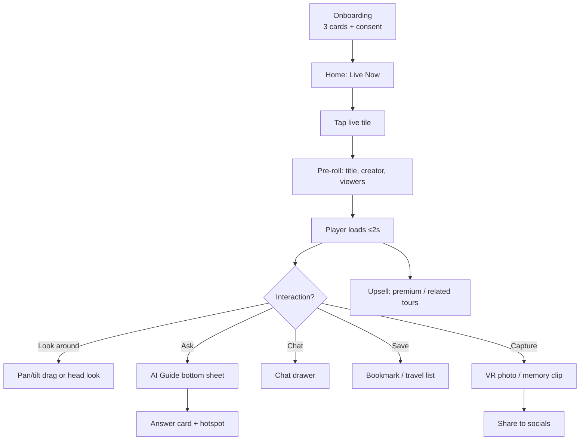

# 07 — UI/UX Design & Wireframes

**WorldView VR** | Version 1.0 | Status: Draft

## 1. Design Principles
1. **"Window, not a screen"** — the interface recedes; the world is the content.
2. **Zero learning curve for seniors & disabled users** — one primary action per screen, generous touch targets (≥ 48 px), 18 pt+ text.
3. **Progressive disclosure** — controls hidden until glance/gaze/gesture, never cluttered.
4. **Consistent cross-platform** — same IA on phone, desktop, VR; platform-specific interaction idioms.
5. **Comfort-first VR** — comfort modes default ON for new users (snap-turn, vignette).
6. **Accessibility by default** — captions on, high contrast option, screen-reader semantics.

## 2. Design System (Tokens)
```
Colors:
  primary      #2E6BFF  (action, live indicators)
  live         #FF3B30  (live/recording)
  background   #0A0F1E  (immersive dark)
  surface      #141B2E
  surface-2    #1D2740
  text         #F4F6FB
  text-muted   #93A0C0
  success      #22C55E
  warning      #F59E0B
  error        #EF4444

Typography:
  Display:  36/44   Serif Display (travel editorial feel)
  Title:    24/32   Sans (Inter)
  Body:     16/24   Sans (Inter)
  Caption:  13/18   Sans

Spacing: 4px grid. Radius: 8 (cards) / 16 (sheets) / full (pills).
Motion: 150ms micro-interactions; 300ms screen transitions; respects prefers-reduced-motion.
```

## 3. Information Architecture

```
Root
├── Discover (Home)
│   ├── Live Now (carousel by region/timezone)
│   ├── Trending Tours
│   ├── AI Picks For You (personalized)
│   └── Map Explorer
├── Explore (Catalog)
│   ├── Categories (Landmark/City/Nature/Festival/Culture/Concert)
│   ├── Search (+ filters)
│   └── Tour detail
├── Watch (Player)
│   ├── Live / VOD player
│   ├── AI Guide (chat/voice)
│   ├── Chat & reactions
│   └── Hotspots & captures
├── Travel (My Space)
│   ├── Travel Lists / Bookmarks
│   ├── Memories (VR photos, clips)
│   └── Watch History
├── Social
│   ├── Friends / Rooms / Watch Together
│   └── Profile & Avatar
└── Creator Studio
    ├── Go Live wizard
    ├── Dashboard & analytics
    └── Earnings & payouts
```

## 4. User Flow: Discover → Watch → Engage



## 5. Mobile Wireframes (ASCII)

### 5.1 Home (Discover)
```
┌─────────────────────────────────────────┐
│ [W] WorldView          🔍    👤  ⚙       │
├─────────────────────────────────────────┤
│ ● LIVE NOW          (swipe carousel)     │
│ ┌──────────────┐ ┌──────────────┐        │
│ │   Shibuya    │ │   Venice     │        │
│ │   ●LIVE 1.2k │ │   ●LIVE 840  │        │
│ └──────────────┘ └──────────────┘        │
│   Trending Tours                         │
│ ┌─────────────────────────────────────┐ │
│ │ 📌 Taj Mahal — AI Guide     >       │ │
│ ├─────────────────────────────────────┤ │
│ │ 📌 Aurora, Norway  — 4K 360°   >    │ │
│ └─────────────────────────────────────┘ │
│   AI Picks For You                      │
│   (horizontal scroll cards)             │
├─────────────────────────────────────────┤
│ [Home] [Explore] [Watch] [Travel] [More]│
└─────────────────────────────────────────┘
```

### 5.2 Watch (Player overlay)
```
┌─────────────────────────────────────────┐
│  ●LIVE    Shibuya Crossing   🌐EN  [min]│
│  @Mira-Tokyo     12,400 viewers         │
│ ┌─────────────────────────────────────┐ │
│ │                                     │ │
│ │            360° VIEWPORT            │ │
│ │       (drag or tilt to look)        │ │
│ │   [💬AI Guide] [⭐Hotspot] [📸]     │ │
│ └─────────────────────────────────────┘ │
│  ──────────────▮─────────────── 0:12    │
│  💬 Chat  🧭 Map  👥 Social             │
│  ─────────────────────────────────────  │
│  [Ask the AI Guide…]                    │
└─────────────────────────────────────────┘
```

### 5.3 AI Guide bottom sheet
```
┌─────────────────────────────────────────┐
│  🤖 World Guide                ✕       │
│  ▍What building is this?                │
│  That's **Tokyo Tower** — built 1958,   │
│  332.9m, inspired by the Eiffel Tower…  │
│  📎 [Tokyo Tower] 📎 [Observation deck] │
│  Ask (voice):  🎤 [Tap to speak]        │
│  Translate sign: [📷 Scan]              │
└─────────────────────────────────────────┘
```

### 5.4 Creator Go-Live wizard
```
┌─────────────────────────────────────────┐
│  Go Live            Step 2/3            │
│  ┌───────────────────────────────────┐  │
│  │ 📷 Device                         │  │
│  │  ( ) Phone camera                 │  │
│  │  ( ) Insta360 X4  [●] 4K 30fps    │  │
│  │  ( ) Drone  ⚠ check local laws    │  │
│  └───────────────────────────────────┘  │
│  Quality test:  📶 34 Mbps ✓           │
│  Battery: 78% ✓   Privacy: ✓           │
│  Consent reminder: blur faces toggle ✓  │
│                    [ Cancel ] [ GO LIVE ]│
└─────────────────────────────────────────┘
```

## 6. VR Interface

### 6.1 Immersion layer
- **360° viewport** is the scene. UI floats in a **contextual ring** (gaze cursor + trigger).
- Look at "AI" orb → guide dialogue attaches to world; look at hotspot → card pops in place.
- **Teleport** = look + thumbstick (comfort-safe); **snap-turn** default 30°.
- **Hands:** pinch to grab/zoom; voice as primary for text input.

### 6.2 VR HUD elements
```
   (Yaw 212° | Pitch -8°)   ── subtle compass
         ● LIVE (pulsing)   ── top center
   [AI Guide] [Hotspots] [Map] [People] ── bottom ring
        left: travel list   right: chat minimap (unread dot)
```

### 6.3 Comfort & safety
- Dynamic FOV vignette during rapid movement; seat-height calibration; adjustable IPD hint.
- "Comfort LUT": presets — **Calm** (no movement, slow fades) / **Balanced** / **Bold** (smooth locomotion) for P1–P4 personas.

## 7. Desktop & Web
- Split view: player left (60%), side panel (chat/hotspots) right; keyboard arrows = pan, WASD = dolly (VOD 3D scenes T2).
- Picture-in-picture for multitasking; keyboard shortcuts `[G] guide, [B] bookmark, [C] capture, [S] share`.
- PWA installable; background audio for ambient streams.

## 8. Accessibility Features (detailed)
| Feature | Scope |
|---|---|
| Auto captions (ASR, translate) | live + VOD, sizes L/XL, high contrast |
| Audio description (AI-generated) | T1, toggled per tour |
| Voice control | "open guide / play / pause / bookmark" |
| Single-switch scanning | focusable elements ordered logically |
| Eye-gaze control | on supported HW (Vision Pro) |
| Reduced motion / no-flash | comfort preset |
| Keyboard-only navigation | web/desktop, visible focus rings |
| WCAG 2.2 AA | mobile/web; audit per release |

## 9. Onboarding (a11y-forward)
1. Language select (defaults to system).
2. Accessibility quick-set (reduce motion? subtitles? font size?) — **not hidden in settings**.
3. Interest picker (3 chips: Cities / Nature / Festivals / Food) → seeds recommendations.
4. Consent screen (3 toggles, plain language, "cookie-free mode" available).
5. First Live tile auto-plays muted preview → one-tap join.

## 10. Design QA Gates
- Per release: axe-core scan (web), color-contrast audit, VR comfort checklist, 2 senior-user usability sessions, WCAG compliance report.
- Design tokens versioned; Figma library ↔ code tokens sync via Tokens Studio.
