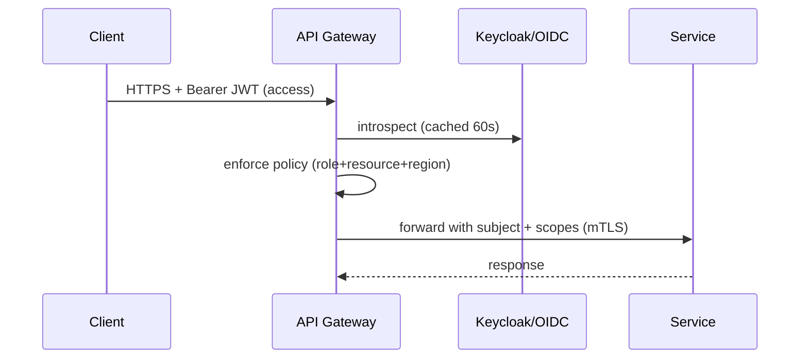

# 08 — Security Architecture

**WorldView VR** | Version 1.0 | Status: Draft

## 1. Security Posture & Principles
- **Zero trust:** no implicit trust inside the perimeter; mTLS between services; least privilege IAM; per-request authz.
- **Defense in depth:** WAF → Gateway authz → service-level policy → data-layer encryption → auditable.
- **Privacy by design:** GDPR/CCPA as a platform capability (consent registry, DPIA, DSR automation), not a retrofit.
- **Tamper-evidence:** signed media, signed webhooks, signed payouts, replay-protected JWTs.
- **Responsible AI:** grounding, citations, toxicity filters, no PII leakage into prompts.

## 2. Threat Model Summary

| Asset | Threat | Mitigation |
|---|---|---|
| User accounts | Credential stuffing / takeover | Argon2id, OTP MFA (default for creators), device management, anomaly login alerts, rate-limited auth + CAPTCHA escalator |
| Live streams | Stream-key theft / hijack | Short-TTL signed keys, per-device binding, IP allowlists on ingest, rotation on status change |
| Media URLs | Leeching / re-sell | HMAC-signed CloudFront URLs, 10-min TTL, per-user binding for premium, watermark overlay for pay-per-tour |
| Payments | Fraud / chargeback abuse | Stripe Radar + custom rules, velocity limits, ID checks for payouts, 3DS2 |
| Creator payouts | Fake/duplicate creator accounts | KYC (ID + liveness), tax ID collection, payout velocity + ACH hold review, device fingerprinting |
| Chat/social | Spam, harassment, CSAM | Inline classifier + hash match (PhotoDNA-style), human review, persistent bans, abuse reports |
| AI guide | Prompt injection / toxic output / PII leak | System-prompt isolation, input sanitization, output moderation, data minimization, no user PII in context |
| User PII | Data breach | Encryption at rest (AES-256), field-level encryption for sensitive columns, secrets in KMS, minimal retention, DSR pipeline |
| Client SDKs | Tampering, reverse-engineered entitlements | Server-side entitlement checks (never trust client), integrity signatures on SDKs, DRM for premium VOD (FairPlay/Widevine) |

## 3. Authentication & Authorization
- **Protocol:** OAuth 2.1 + OpenID Connect (PKCE). Access token = short-lived JWT (15 min, audience-scoped), refresh token = rotating, device-bound, revocable.
- **AuthZ model:** RBAC + ABAC hybrid.
  - Roles: `user`, `creator`, `guide`, `admin`, `enterprise_admin`.
  - Policies: resource ownership (`tour.creator_id == session.user_id`), region residency, entitlement (premium flag).
- **Keycloak** self-hosted (or Auth0 accelerator); tokens validated at Gateway; services use service-to-service tokens (SPIFFE/mTLS).



## 4. Data Protection
- **In transit:** TLS 1.3 everywhere; HSTS; QUIC for media.
- **At rest:** S3/DB/EBS encryption (AWS KMS, per-env CMKs); field-level encryption (KMS envelope) for email/phone/payment tokens.
- **Media rights:** premium VOD via DRM (FairPlay, Widevine, PlayReady) + signed manifest; live free-tier watermarkless; pay-per-tour watermarked (session ID burned in).
- **Key management:** KMS customer keys, rotation 90 d, Hardware HSM for DRM keys (AWS MediaStoreKey / custom).

## 5. Privacy & GDPR/CCPA
- **Consent registry:** every purpose (personalization, marketing, 3rd-party sharing) has a policy version + timestamp + provenance.
- **DSR pipeline:** `export`/`delete` via API → Kafka workflow → each service scrubs/redacts → completion receipt; SLA 30 d (GDPR), 45 d (CCPA).
- **Data residency:** EU users pinned to eu-west-1 cluster; residency metadata on accounts; cross-region sync restricted to anonymized aggregates.
- **DPA + SCCs** with all subprocessors (cloud, AI vendors, payments); subprocessor list published; DPIA published.
- **Children:** age gate (13+ EU, 13+ US COPPA); no targeted ads to minors; guardian mode.

## 6. Moderation & Safety Architecture

```mermaid
flowchart LR
    A[Stream/Chat/Profile event] --> B[Auto-mod fast path: regex + classifier]
    B -->|score < 0.3| C[Approved - stream/display]
    B -->|0.3 <= score < 0.7| D[Hold - human queue]
    B -->|score >= 0.7| E[Auto-block + notify creator + report]
    B --> F[Hash match - CSAM/TM] --> G[Immediate removal + legal report]
    D --> H[Human reviewer decision]
    H --> I[Approve] / J[Remove + enforce policy]
```
- **In-stream:** live preview to human mods via low-res proxy; keyword + ASR transcription flags; blur faces toggle for consent.
- **Escalation SLA:** harassment/CSAM = minutes; borderline = < 24 h.
- **Reporting:** in-app report with reason taxonomy; report status notifications; serial abuser detection.

## 7. Secure Development Lifecycle (SDLC)
- Threat modeling (STRIDE) per feature; SAST (Semgrep/Snyk), DAST, dependency scanning, container scanning in CI (see [DevOps](09-devops-cicd.md)).
- Secrets scanning in PRs; environment split; no secrets in client bundles.
- Penetration test quarterly + responsible disclosure program + bug bounty.
- Incident response: severity matrix, on-call IR team, customer communication templates, postmortems mandatory.

## 8. Compliance Register
| Regime | Scope | Actions |
|---|---|---|
| GDPR / UK GDPR / CCPA / CPRA | All users; strongest applies | DSR, DPIA, DPA, residency, minors |
| PCI-DSS | Payment flows | Tokenization via Stripe; no PAN/PIN in scope |
| COPPA / minor data | Under-13 | Age gate, guardian controls |
| AV rules (EU DSA) | Platform liability | Notice-and-action, traceability of creators, annual transparency report |
| Drone / filming law | Creator operations | Jurisdiction-aware legal checker, geo-blocking enforcement |
| Accessibility (ADA/EAA) | Apps | WCAG 2.2 AA, VPAT per release |
| Data localization | EU, CN, others | EU residency cluster; CN = partner/local compliance |

## 9. Security Operations
- **Logging:** auth events, entitlement changes, payment ops, moderation actions, admin actions (audit log, immutable).
- **SIEM:** Sentinel/Splunk ingestion of security events; alerting on brute force, anomalous geo, token replay, mass data export.
- **24×7 SOC:** triage alerts, runbooks, on-call rotation; forensic snapshots preserved.
- **Backups/DR security:** encrypted backups, restricted restore permissions, ransomware-tolerant (immutable bucket + backups).

## 10. Vendor & AI Security
- Model gateway logs (prompts/responses) are PII-stripped before vendor egress; EU-bound models where residency required; contracts include DPA + no-training clauses.
- Prompt injection defenses: prompt sandboxing, input validation, tool-call allowlist, output filter.

## 11. Key Metrics (security SLOs)
- AuthN downtime: 0 (graceful degrade to signed-out read-only catalog).
- DSR completion: 100% within SLA.
- Critical vuln time-to-patch: < 7 d (≤ 48 h for actively exploited).
- Moderation false-positive rate on approved content: < 1%.
