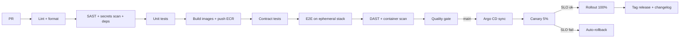

# 09 — DevOps & CI/CD Architecture

**WorldView VR** | Version 1.0 | Status: Draft

## 1. Infrastructure as Code & Environments

| Env | Purpose | Isolation | Data |
|---|---|---|---|
| `dev` | Day-to-day; per-PR ephemeral stacks | Namespace per PR | Synthetic |
| `staging` | Pre-prod parity; media + AI mocks/real | Dedicated AWS account | Anonymized subset |
| `perf` | Load testing; chaos | Dedicated account | Synthetic scale |
| `prod` | Live | Dedicated account, 3+ regions | Real |

- **Terraform** for AWS (accounts, VPC, EKS, Aurora, MSK, S3, CloudFront, IAM). Modules per service; workspaces per region.
- **Kubernetes (EKS)** as the runtime; **Helm** charts per service; **Argo CD** GitOps for deployment state.
- **Kustomize/Helm overlays** handle per-region differences (endpoints, limits).

## 2. CI/CD Pipeline

### Quality gates
- Lint (golangci-lint / ruff / eslint), formatting (gofmt/black/prettier), SAST (Semgrep), dependency audit (Snyk), container scan (Trivy), secret scan (gitleaks), license check.
- Unit coverage ≥ 80% on critical paths; 0 breaking changes against contracts.
- Pipeline wall-clock target: **< 15 min** on main.

### Deployment model
- **Feature flags** (OpenFeature/LaunchDarkly) for all user-facing toggles → instant kill switch, decoupled from deploy.
- **Canary + Argo Rollouts:** 5% → 25% → 100%; analysis steps on SLO burn + error budget; auto-rollback.
- **Migrations:** expand-and-contract (dual-write, backfill, cutover, drop) — no downtime; schema migrations versioned + reviewed by DBAs.

## 3. Multi-Region Deploy Topology
- Same Helm chart to all regions; **GitOps promotes a single manifest** → regions deploy within minutes; media/edge config via CloudFront + Route53.
- Regional config in `values-region.yaml`; regional endpoints discovered via service mesh.

## 4. Kubernetes Platform Services
- **Ingress/mesh:** Envoy Gateway + Istio (mTLS, canary routing, circuit breakers).
- **Autoscaling:** HPA (CPU + custom metrics: queue lag, concurrent viewers) + KEDA for event-driven (Kafka lag, SQS).
- **Spot handling:** media transcode pool on Spot (Karpenter) with instance diversity; critical control plane on on-demand.
- **Chaos engineering:** Litmus/Gremlin monthly in `perf` (network partition, node kill, DB failover, SFU kill) to validate runbooks.

## 5. Observability Stack

| Concern | Tools |
|---|---|
| Metrics | Prometheus + Grafana (+ Datadog optional) |
| Tracing | OpenTelemetry Collector → Tempo/Jaeger (or Datadog APM) |
| Logs | Loki/OpenSearch (PII-stripped) |
| Errors | Sentry (client + server) |
| Synthetic | CloudWatch Synthetics / Checkly (multi-region watch checks, stream start time) |
| SLO/Alerting | Prometheus recording rules → Alertmanager; burn-rate alerting; incident via Opsgenie/PagerDuty |

- **Golden signals:** RED per service; **SLOs from NFR** mapped to dashboards with burn-rate (fast=5m/1h, slow=1d) alerts.
- **Business observability:** Kafka events → lakehouse → dbt → BI dashboards (MAU, watch-time, revenue, churn).
- **Media QoE:** per-viewer bitrate, rebuffer ratio, FOV stall, glass-to-glass latency; SLO per protocol tier.

## 6. Release Process & Incident Management
- **Releases:** weekly cadence (Thurs), feature-flagged; hotfix path gated on trunk-canary; release train with changelogs.
- **Incident:** Sev1 (customer-impacting outage) → page, bridge, DR runbook; Sev2 → business-hours triage. Postmortems: blameless, action items tracked, 5-why.
- **DR plan:** RPO 5 min / RTO 30 min for control plane; media RTO = rebuffer on failover. Annual DR game-day in `perf`.

## 7. Cost Management (FinOps)
- Budgets + anomaly alerts per service/region (AWS Budgets, Kubecost).
- Spot-first for media; scheduled scale-down for non-prod; rightsizing reports monthly.
- Cost allocation tags per service; chargeback to business units at V1.

## 8. Compliance in the Pipeline
- IaC scanning (Checkov/TFsec) in CI; SBOM generated per image (Syft); image signing (cosign) + admission policy in prod.
- Security gates before prod promote; audit logs for all CI/CD actions; SOAR hooks for SIEM.
