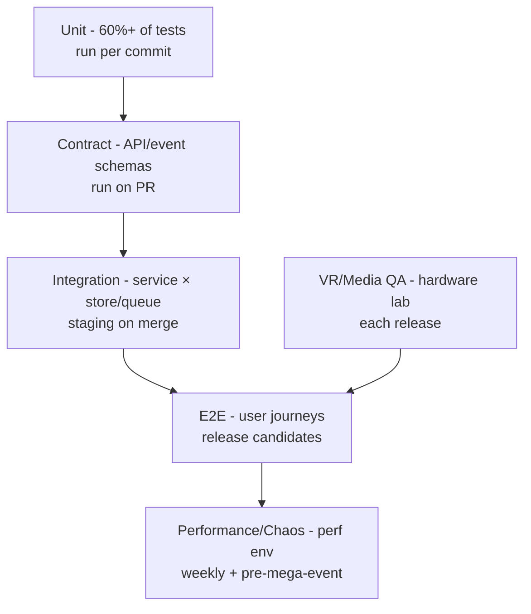

# 10 — Testing Strategy

**WorldView VR** | Version 1.0 | Status: Draft

## 1. Test Pyramid & Commit Gate

- **Unit:** business logic, pure functions; mocking external I/O. Target ≥ 80% on critical paths (payments, moderation scoring, entitlements, tile math).
- **Contract:** OpenAPI + proto + event-schema contract tests (Pact-style) gate producers/consumers in CI — prevents silent breakage across 14 services.
- **Integration:** service × Postgres/Redis/Kafka/Milvus/OpenSearch; seed fixtures; transaction isolation and idempotency tests.
- **E2E:** Playwright (web), Detox/XCUITest (mobile), Appium (Android), VR headset automation where available. Test critical journeys (join live → AI ask → tip → bookmark; creator go-live → end → VOD).

## 2. Media Pipeline Testing
| Layer | Test |
|---|---|
| Ingest (SRT/RTMP) | Loss injection (0–30%), jitter, reconnect; assert ARQ recovery, no dead segments |
| Transcode | Golden-frame comparison for tiling/seam stitching; audio sync (A/V offset < 40 ms) |
| Packaging | LL-HLS manifest correctness; partial segment timing; DVR window |
| Delivery | Per-region glass-to-glass latency measurement on synthetic clients |
| DRM | FairPlay/Widevine/PlayReady happy + tamper paths; offline expiry |

## 3. VR & UX-Specific QA
- **Hardware lab:** Quest 2/3/Pro, Vision Pro (T1), Pico, PSVR2 (T1), phone + cardboard/test fixture.
- Comfort checklist: motion-sickness protocols (vignette, snap-turn, seating height), forced 20-min sessions with sensors (heart-rate optional).
- Accessibility audit: axe-core, color-contrast, keyboard-only, screen-reader (NVDA/VoiceOver), switch-access script.
- Localization QA: RTL languages, CJK glyph rendering in UI + captions.

## 4. AI Quality Testing
- **Evaluation harness (offline):**
  - QA benchmark per language (500 Qs/locale) — grounding accuracy, citation correctness, toxicity, hallucination rate.
  - Visual benchmark: landmark/plant/animal classification accuracy on labeled frames.
  - ASR WER per locale; TTS naturalness (MOS) sampling; translation BLEU/COMET.
- **Online guardrails:** canary prompts sampling; "answer quality" implicit feedback (thumbs, follow-up rate); drift alerts when benchmark regresses.
- **Prompt/red-team:** adversarial suite run before every model-provider or prompt change.

## 5. Load, Performance & Chaos Testing
- **Load model:** replay synthetic watch-sessions at 1×–10× forecast (join storm, hot room fan-out, mega-event scenario).
- **Performance SLOs verified:** stream start ≤ 2 s p95 at 500K concurrent; API P95; chat E2E.
- **Chaos (perf env, monthly):** kill SFU node, failover Aurora, partition Kafka, kill transcode worker — validate SLO recovery and no stuck streams.
- **Cost guard:** load tests emit cost report (media $/hr) — catch runaway egress before it hits prod.

## 6. Test Data & Environments
- Synthetic PII-safe data; GDPR test-account lifecycle (export/delete tested in staging).
- Seeded content: curated 20 tours, 5 live simulators (headless creators broadcasting synthetic scenes).
- Perf env mirrors prod topology at 10% scale with full media path.

## 7. CI/CD Test Automation
- Every PR: unit + lint + SAST + build + contract. Every merge: integration + E2E smoke (top-10 journeys).
- Release candidate: full E2E + AI benchmarks + media pipeline + VR lab subset.
- Canary: SLO-based analysis gates rollout (see [DevOps](09-devops-cicd.md)).

## 8. Acceptance & Regression Discipline
- Test cases trace to SRS FRs/NFRs (traceability matrix in CI report).
- Regression suite must run < 30 min (parallel sharded); nightly full run.
- Bug severity → release-blocker policy; Sev1 = canary blocked.

## 9. Sample Test Plan (Sprint-level)
1. New feature → unit + contract first (TDD on critical paths).
2. Feature flag ON in staging → integration + E2E.
3. Release: VR lab + accessibility + AI benchmarks (if AI changed).
4. Post-release: canary metrics + user feedback loop (NPS/ratings) → backlog.
