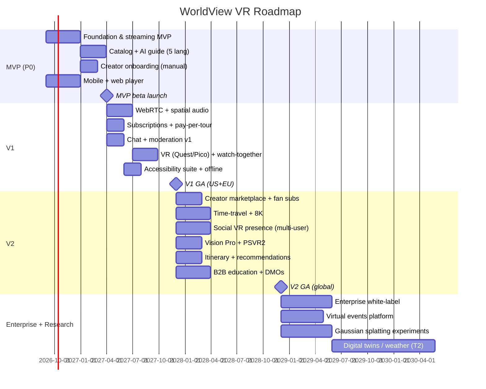

# 13 — Development Roadmap, Team & Costs

**WorldView VR** | Version 1.0 | Status: Draft

## 1. Phase Plan Overview

| Phase | Name | Duration | Users | Scope | Exit criteria |
|---|---|---|---|---|---|
| **P0** | **MVP / Alpha** | 6–8 mo | 5–10K beta | Live streaming (LL-HLS 1080p/4K), catalog VOD, AI guide (text, 5 langs), captions, basic social (watch later), tips, creators (verified, manual) | 5K MAU beta, 20 creators, glass-to-glass < 5 s, D30 20% |
| **P1** | **Beta / V1** | 8–12 mo | 250K | WebRTC premium path, spatial audio, live chat+mod, pay-per-tour, subscriptions, VR (Quest/Pico), watch-together, accessibility suite, offline | 250K reg, 30K WAU, 3% paying, uptime 99.9%, EU+US regions |
| **P2** | **Version 1 GA → V2** | 12–18 mo | 3M+ | Creator marketplace, tips+fan subs, time-travel, social VR presence (multi-user), 8K, Vision Pro + PSVR2, itinerary/recommendations, B2B/education, DMO partnerships | 3M reg, 10K MAU→10M trajectory, 6% paying, APAC region |
| **P3** | **Enterprise Edition + Scale** | 18–36 mo | 10M+ | White-label/enterprise, virtual events, digital-twin experiments (Gaussian Splatting), dynamic weather/lighting (T2), 16K (T2), MR mode | 10M MAU, 100M-scale architecture proven, >55% GM |

## 2. Team Sizing & Roles

### Core team through MVP (≈ 20–24 FTE)
| Discipline | Count | Notes |
|---|---|---|
| Engineering | 12 | 3 media/streaming, 3 backend (Go), 2 frontend/mobile (RN), 2 VR/Unity, 2 AI/ML, plus infra embedded |
| Product/Design | 4 | 1 PM, 1 UX, 1 visual, 1 accessibility specialist |
| Data/Analytics | 2 | data eng + analytics |
| SRE/DevOps | 2 | shared across team |
| Content/Ops | 2 | creator onboarding, moderation ops, community |
| Business/GTM | 3 | BD (DMOs), marketing, partnerships |
| Legal/compliance | 1 | part-time/contract → full at V1 |

### Growth to V1 (≈ 40–50 FTE) and V2 (≈ 80–100 FTE)
- V1 adds: more mobile/iOS/Android, VR engineers, real-time comms (WebRTC), security engineer, more AI engineers, moderation ops team (3–5), finance/revops.
- V2 adds: enterprise sales (2–3), regional content ops, data platform engineers, more SRE + on-call.

**Org shape:** 4 squads — **Media**, **Platform (backend)**, **Immersion (AI/VR)**, **Growth/Commerce** — each with product+eng embedded; SRE/security/legal as platform guilds.

## 3. Engineering Effort Estimates (person-months, high level)

| Workstream | MVP | V1 | V2 |
|---|---|---|---|
| Streaming pipeline (ingest, tiling, LL-HLS, WebRTC) | 18 | 12 | 10 |
| Player/VR client (RN + Unity + web) | 16 | 14 | 12 |
| Backend services (identity, catalog, streaming-control, social) | 18 | 14 | 12 |
| AI guide (RAG, vision, ASR/TTS/translation, eval harness) | 12 | 10 | 10 |
| Payments/billing/creator economy | 6 | 6 | 8 |
| Moderation & safety | 4 | 5 | 5 |
| Observability/SRE/security | 6 | 5 | 5 |
| Data platform (lakehouse, analytics, rec) | 5 | 6 | 8 |
| **Total** | **~85 PM** | **~72 PM** | **~70 PM** |

## 4. Infrastructure Cost Estimates

### MVP (1 region, 5–10K users) — ~$25–40K/mo
| Line | Monthly |
|---|---|
| Media/CDN (LL-HLS, 1080p/4K) | $10–18K |
| Compute (EKS, control plane) | $6–9K |
| Data (Aurora, Redis, Kafka, Milvus, OpenSearch) | $5–8K |
| AI inference (guide/ASR/TTS) | $2–4K |
| Monitoring/security/other | $2–3K |

### V1 (3 regions, 250K users, ~20K concurrent viewers) — ~$120–180K/mo
| Line | Monthly |
|---|---|
| Media/CDN + WebRTC SFU | $60–90K |
| Compute (EKS + media pools) | $25–40K |
| Data layer | $15–25K |
| AI inference | $10–15K |
| SRE/monitoring/security/other | $10K |

### V2 (3–4 regions, 10M users, 1M concurrent) — ~$1.2–2.0M/mo
| Line | Monthly |
|---|---|
| Media/CDN + SFU (tiered) | $600–1,000K |
| Compute | $250–400K |
| Data layer | $120–200K |
| AI inference (4K answers/sec peak) | $120–180K |
| SRE/monitoring/security/other | $100–150K |

**Efficiency levers:** tiled viewport (4–10×), LL-HLS-first for free tier, spot transcode, committed CDN contracts, on-device inference for TTS/captions where viable, cache-friendly content ops.

## 5. Burn & Funding Scenario (illustrative)

| Period | Team | Monthly burn | Infra | Total monthly | Cumulative (18 mo) |
|---|---|---|---|---|---|
| MVP (mo 0–8) | 24 FTE | ~$420K | $35K | ~$455K | ~$3.6M |
| V1 ramp (mo 9–18) | 40 FTE | ~$700K | $150K | ~$850K | ~$8.5M |
| **Total 18 mo** | | | | | **~$12M** |

Revenue offset at mo 18 (illustrative): 250K reg × 3% paying × $9.99 + tips/tours → ~$120–160K/mo. Breakeven assumed at V2 with 1M+ paying equivalents or strong B2B book.

## 6. Milestones & Dependencies

## 7. Prioritization Guardrails
- **Ship liveness first** — it's the moat. Never block live on AI polish.
- **AI guide is second-class critical** — good enough at launch, iterate fast; it's a retention lever.
- **Social VR is a V2 feature** — avoid early multiplayer complexity.
- **Speculative (T2)** — digital twins, dynamic weather, 16K — only after unit economics proven and flagged as research.
- **Compliance gates** at each region expansion: legal + data residency + moderation SLA before launch.

## 8. What's Available Today vs. Speculative (honest labeling)
**Today (ship now):** live 360° (LL-HLS + WebRTC), tiled streaming, spatial audio (Ambisonics/binaural), ASR/translate captions, RAG AI guide, mobile/web/desktop players, Quest/Pico VR, subscriptions/tips/pay-per-tour, verified creator platform, moderation.
**Near-term (12–24 mo):** 8K, Vision Pro/PSVR2, multi-user social VR presence, vision-based object/landmark ID, sign translation, DRM offline, itinerary generation, B2B education.
**Speculative/research (T2):** full city digital twins, real-time photogrammetry/gaussian splatting at scale, dynamic weather + relighting of real video, 16K streaming, haptic suits, true 6-DoF from single-stream reconstructions. These are de-risked, not committed.

## 9. Success Exit Criteria per Phase
- **P0 → P1:** 5K MAU, 20 verified creators, stream latency SLO met, D30 ≥ 20%, NPS ≥ 40.
- **P1 → P2:** 250K registered, 30K WAU, 3% paying, EU+US regions live, 99.9% uptime, mod SLA met.
- **P2 → P3:** 3M registered, 10M trajectory, 6% paying, APAC live, ≥ 2 DMO + 1 enterprise anchor, 55% blended GM.
